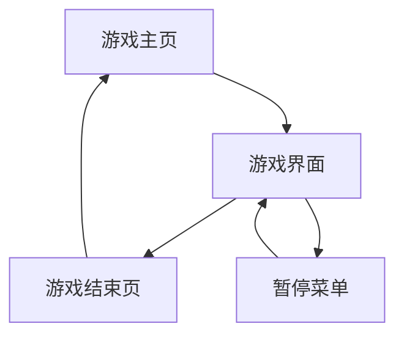

# 红白机打蜜蜂游戏 - 产品需求文档

## 1. Product Overview
经典红白机风格的打蜜蜂射击游戏网页版，玩家控制飞机射击敌机获得分数。
- 复刻经典红白机游戏体验，提供怀旧的像素风格和简单易上手的操作方式。
- 目标用户为喜欢复古游戏的玩家和寻求休闲娱乐的用户群体。

## 2. Core Features

### 2.1 User Roles
本游戏为单机游戏，无需用户注册或登录系统。

### 2.2 Feature Module
我们的打蜜蜂游戏包含以下主要页面：
1. **游戏主页**：游戏标题、开始按钮、最高分显示、操作说明。
2. **游戏界面**：游戏画布、得分显示、生命值显示、暂停功能。
3. **游戏结束页**：最终得分、最高分记录、重新开始按钮。

### 2.3 Page Details

| Page Name | Module Name | Feature description |
|-----------|-------------|---------------------|
| 游戏主页 | 标题区域 | 显示游戏名称和像素风格logo |
| 游戏主页 | 控制按钮 | 开始游戏按钮，触发游戏开始 |
| 游戏主页 | 分数显示 | 显示历史最高分记录 |
| 游戏主页 | 操作说明 | 显示键盘控制说明（方向键移动，空格键射击） |
| 游戏界面 | 游戏画布 | 800x600像素游戏区域，包含玩家飞机、敌机、子弹、背景 |
| 游戏界面 | 玩家飞机 | 键盘控制移动（方向键），空格键发射子弹，碰撞检测 |
| 游戏界面 | 敌机系统 | 随机生成不同类型敌机，自动移动模式，被击中后消失并加分 |
| 游戏界面 | 射击系统 | 子弹发射、移动、碰撞检测，限制同时存在的子弹数量 |
| 游戏界面 | 状态显示 | 实时显示当前得分、剩余生命值、当前关卡 |
| 游戏界面 | 暂停功能 | ESC键暂停游戏，显示暂停菜单 |
| 游戏界面 | 关卡系统 | 根据得分自动提升关卡，增加敌机数量和移动速度 |
| 游戏结束页 | 结果显示 | 显示本次游戏得分和历史最高分 |
| 游戏结束页 | 重新开始 | 重新开始按钮返回游戏主页 |

## 3. Core Process

**主要游戏流程：**
1. 玩家进入游戏主页，查看最高分和操作说明
2. 点击开始游戏按钮进入游戏界面
3. 使用方向键控制飞机移动，空格键射击
4. 击中敌机获得分数，被敌机撞击或敌机子弹击中失去生命
5. 生命值归零时游戏结束，显示最终得分
6. 可选择重新开始游戏

## 4. User Interface Design

### 4.1 Design Style
- **主色调**：深蓝色背景(#001122)，绿色UI元素(#00FF00)
- **次要颜色**：白色文字(#FFFFFF)，红色警告(#FF0000)，黄色高亮(#FFFF00)
- **按钮样式**：像素风格矩形按钮，带有简单边框效果
- **字体**：等宽像素字体，主要文字16px，标题24px
- **布局风格**：居中对齐，简洁的卡片式布局
- **图标风格**：8位像素风格图标和精灵图

### 4.2 Page Design Overview

| Page Name | Module Name | UI Elements |
|-----------|-------------|-------------|
| 游戏主页 | 标题区域 | 大号像素字体标题，居中显示，黄色(#FFFF00) |
| 游戏主页 | 控制按钮 | 绿色矩形按钮，白色文字，悬停时亮度增加 |
| 游戏主页 | 分数显示 | 白色文字，右上角显示"最高分：XXXXX" |
| 游戏界面 | 游戏画布 | 深蓝色背景，星空点缀效果，固定800x600尺寸 |
| 游戏界面 | 状态栏 | 顶部固定栏，显示得分、生命、关卡，绿色文字 |
| 游戏界面 | 飞机精灵 | 像素风格飞机图案，白色/蓝色配色 |
| 游戏界面 | 敌机精灵 | 红色/橙色像素敌机，不同大小表示不同类型 |
| 游戏结束页 | 结果面板 | 半透明黑色背景，白色边框，居中显示 |

### 4.3 Responsiveness
游戏采用桌面优先设计，固定画布尺寸800x600像素，支持键盘操作。在移动设备上提供虚拟按键支持触摸操作。