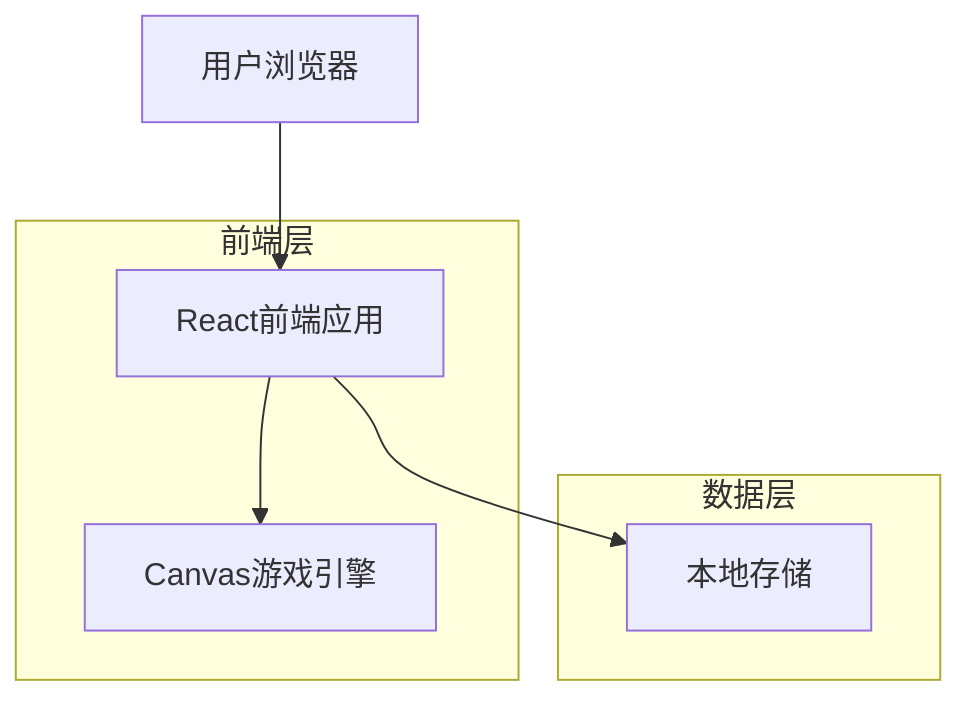
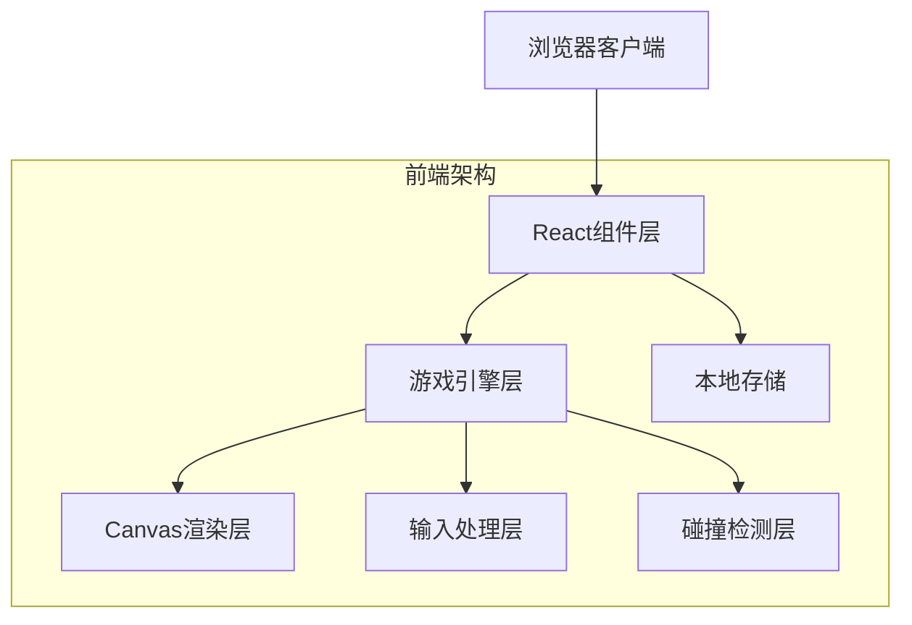
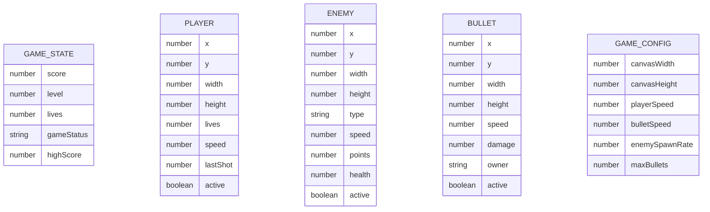

# 红白机打蜜蜂游戏 - 技术架构文档

## 1. Architecture design



## 2. Technology Description

* Frontend: React\@18 + TypeScript + Canvas API + Vite

* Styling: CSS3 + 像素风格样式

* Storage: LocalStorage (存储最高分)

* Build Tool: Vite

* Package Manager: npm

## 3. Route definitions

| Route     | Purpose            |
| --------- | ------------------ |
| /         | 游戏主页，显示标题、开始按钮和最高分 |
| /game     | 游戏界面，主要游戏逻辑和画布渲染   |
| /gameover | 游戏结束页面，显示得分和重新开始选项 |

## 4. API definitions

### 4.1 Core Types

游戏核心数据类型定义：

```typescript
// 游戏对象基类
interface GameObject {
  x: number;
  y: number;
  width: number;
  height: number;
  active: boolean;
}

// 玩家飞机
interface Player extends GameObject {
  lives: number;
  speed: number;
  lastShot: number;
}

// 敌机
interface Enemy extends GameObject {
  type: 'small' | 'medium' | 'large';
  speed: number;
  points: number;
  health: number;
}

// 子弹
interface Bullet extends GameObject {
  speed: number;
  damage: number;
  owner: 'player' | 'enemy';
}

// 游戏状态
interface GameState {
  score: number;
  level: number;
  lives: number;
  gameStatus: 'menu' | 'playing' | 'paused' | 'gameover';
  highScore: number;
}

// 游戏配置
interface GameConfig {
  canvasWidth: number;
  canvasHeight: number;
  playerSpeed: number;
  bulletSpeed: number;
  enemySpawnRate: number;
  maxBullets: number;
}
```

### 4.2 Game Engine API

```typescript
// 游戏引擎主类
class GameEngine {
  // 初始化游戏
  init(canvas: HTMLCanvasElement): void;
  
  // 开始游戏
  startGame(): void;
  
  // 暂停游戏
  pauseGame(): void;
  
  // 结束游戏
  endGame(): void;
  
  // 游戏主循环
  gameLoop(): void;
  
  // 渲染所有游戏对象
  render(): void;
  
  // 更新游戏逻辑
  update(deltaTime: number): void;
  
  // 处理用户输入
  handleInput(keys: Set<string>): void;
  
  // 碰撞检测
  checkCollisions(): void;
  
  // 生成敌机
  spawnEnemy(): void;
  
  // 发射子弹
  shootBullet(x: number, y: number, owner: 'player' | 'enemy'): void;
}
```

## 5. Server architecture diagram

本游戏为纯前端单机游戏，无需服务器架构。所有游戏逻辑在浏览器端运行。



## 6. Data model

### 6.1 Data model definition



### 6.2 Data Definition Language

由于是纯前端游戏，数据存储使用浏览器LocalStorage：

```typescript
// 本地存储键名定义
const STORAGE_KEYS = {
  HIGH_SCORE: 'bee_game_high_score',
  GAME_SETTINGS: 'bee_game_settings'
} as const;

// 存储最高分
function saveHighScore(score: number): void {
  localStorage.setItem(STORAGE_KEYS.HIGH_SCORE, score.toString());
}

// 读取最高分
function getHighScore(): number {
  const stored = localStorage.getItem(STORAGE_KEYS.HIGH_SCORE);
  return stored ? parseInt(stored, 10) : 0;
}

// 游戏配置默认值
const DEFAULT_CONFIG: GameConfig = {
  canvasWidth: 800,
  canvasHeight: 600,
  playerSpeed: 5,
  bulletSpeed: 8,
  enemySpawnRate: 0.02,
  maxBullets: 5
};

// 敌机类型配置
const ENEMY_TYPES = {
  small: {
    width: 30,
    height: 30,
    speed: 2,
    points: 100,
    health: 1
  },
  medium: {
    width: 50,
    height: 50,
    speed: 1.5,
    points: 200,
    health: 2
  },
  large: {
    width: 80,
    height: 80,
    speed: 1,
    points: 500,
    health: 3
  }
} as const;
```

